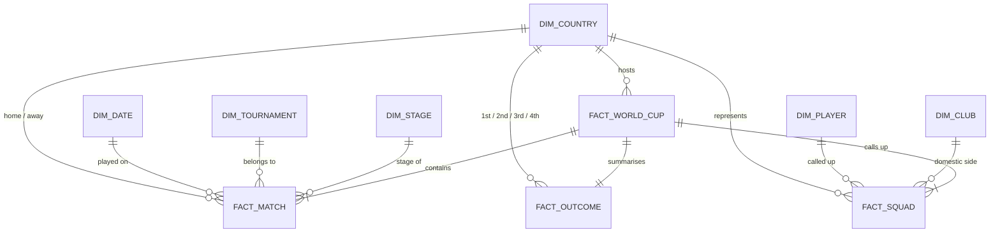

# Fifa2024 — Optimised Data Model

This document describes the analytical star-schema layered on top of the seven physical tables in the `Fifa2024` Postgres database. The model is the single source of truth for the Qatar 2022 dashboard and any future tournament reporting.

## Goals

1. **One row per match.** Eliminate the awkward "home / away union" pattern that physical tables force on every aggregate.
2. **Conformed countries.** `Germany FR` and `Germany` collapse to a single key so a 92-year history rolls up cleanly.
3. **Data + schedule co-existence.** Treat 2022 (schedule only) and 1930-2018 (with goals) as the same fact table at different grains rather than separate stovepipes.
4. **Star, not snowflake.** Dimensions are flat tables addressed by surrogate keys. No joins-to-joins.

## Source tables (physical)

| Table | Grain | Rows | Notes |
|---|---|---|---|
| `world_cups` | One per edition (1930-2022) | 22 | Hosts, podium, goals, qualified teams. 2022 podium columns are NULL. |
| `world_cup_matches` | One per match (1930-2018) | 900 | Includes scores and `win_conditions`. |
| `wc2022_matches` | One per match (2022) | 64 | **Schedule only — no goals.** |
| `wc2022_groups` | One per team-edition (2022) | 32 | Group letter + FIFA ranking. |
| `wc2022_squads` | One per player-edition (2022) | 831 | Player, position, age, caps, goals, wc_goals, league, club. Captain is encoded as `(captain)` suffix in `player`. |
| `international_matches` | One per international fixture | 17,769 | All friendlies, qualifiers and continental cups, 1872-2022. |
| `data_dictionary` | Documentation table | — | Field-level metadata. |

## Target model (logical)



### Dimensions

**`dim_country`**

| Column | Type | Notes |
|---|---|---|
| country_id | int PK | Surrogate. |
| canonical_name | text | Modern name — e.g. `Germany`. Use this in every rollup. |
| historical_aliases | text[] | `{Germany FR, West Germany, Soviet Union}` etc. |
| confederation | text | `UEFA`, `CONMEBOL`, `AFC`, `CAF`, `CONCACAF`, `OFC`. |
| iso_code | char(2) | ISO 3166-1 alpha-2. Drives flag emoji and map pin. |
| latitude | numeric | Approximate centroid. |
| longitude | numeric | Approximate centroid. |

**`dim_date`** — standard calendar dimension. Keys: `date_id (yyyymmdd int PK)`, `full_date`, `year`, `month`, `decade`, `is_world_cup_year`.

**`dim_tournament`** — flat list of tournaments seen in `international_matches.tournament` plus the World Cup itself.

**`dim_stage`** — `Group stage`, `Round of 16`, `Quarter-finals`, `Semi-finals`, `Third place`, `Final`, plus historical variants.

**`dim_player`** — `player_id`, `canonical_name`, `is_captain` (parsed from `(captain)` suffix), DOB if available.

**`dim_club`** — `club_id`, `name`, `league_country_id` (FK back to `dim_country`).

### Facts

**`fact_world_cup`** — one row per edition. Loads from `world_cups`.

**`fact_outcome`** — one row per edition with the podium normalised. Allows the dashboard to query "all titles for team X" with a single SUM rather than four UNIONs.

**`fact_match`** — one row per match. Loads from the union of `world_cup_matches`, `wc2022_matches`, and `international_matches`.

| Column | Type | Notes |
|---|---|---|
| match_id | int PK | Synthetic across all sources. |
| date_id | int FK | |
| tournament_id | int FK | |
| stage_id | int FK | NULL for friendlies. |
| year_id | int FK | NULL when not WC. |
| home_country_id | int FK | |
| away_country_id | int FK | |
| home_goals | int | NULL for 2022 schedule. |
| away_goals | int | NULL for 2022 schedule. |
| host_team_at_home | bool | |
| decided_in_extra_time | bool | Parsed from `win_conditions`. |
| decided_on_penalties | bool | Parsed from `win_conditions`. |

**`fact_squad`** — one row per player called up to a tournament edition.

### View: `vw_team_match`

The single most-used artifact. One row per team per match — eliminates home/away unions everywhere.

```sql
CREATE OR REPLACE VIEW vw_team_match AS
SELECT match_id, date_id, tournament_id, stage_id, year_id,
       home_country_id AS country_id, away_country_id AS opponent_id,
       home_goals AS gf, away_goals AS ga,
       CASE WHEN home_goals>away_goals THEN 'W'
            WHEN home_goals=away_goals THEN 'D' ELSE 'L' END AS result,
       'home' AS venue
FROM fact_match WHERE home_goals IS NOT NULL
UNION ALL
SELECT match_id, date_id, tournament_id, stage_id, year_id,
       away_country_id, home_country_id,
       away_goals, home_goals,
       CASE WHEN away_goals>home_goals THEN 'W'
            WHEN home_goals=away_goals THEN 'D' ELSE 'L' END,
       'away'
FROM fact_match WHERE home_goals IS NOT NULL;
```

## Source-to-target transforms

| From | To | Transform |
|---|---|---|
| `world_cups` | `fact_world_cup` + `fact_outcome` | Split podium columns into a separate fact. |
| `world_cup_matches` | `fact_match` (`tournament=World Cup`) | Add `stage_id`, derive `decided_in_extra_time` / `decided_on_penalties` from `win_conditions`. |
| `wc2022_matches` | `fact_match` (`year=2022`) | Same fact, no goals. |
| `international_matches` | `fact_match` | Map `tournament` to `dim_tournament`. |
| `wc2022_groups` | Slowly-changing attribute on `dim_country` (`fifa_ranking_at_draw_2022`) | Group letter is duplicated onto `fact_squad` for convenience. |
| `wc2022_squads` | `fact_squad` + `dim_player` + `dim_club` | Captain flag stripped from name into `dim_player.is_captain`; club & league lifted out. |

## Recommended indexes

```sql
CREATE INDEX ix_match_year_country ON fact_match (year_id, home_country_id, away_country_id);
CREATE INDEX ix_match_tournament_date ON fact_match (tournament_id, date_id);
CREATE INDEX ix_squad_team ON fact_squad (year_id, country_id);
CREATE INDEX ix_country_canonical ON dim_country (canonical_name);
```

## Why this shape pays off

Every dashboard tile collapses to a single short query against this model:

- All-time titles — `SELECT winner_id, COUNT(*) FROM fact_outcome GROUP BY 1`
- Team match record — `SELECT country_id, result, COUNT(*) FROM vw_team_match WHERE tournament_id = :wc GROUP BY 1,2`
- Top scorers per tournament — `SELECT player_id, intl_goals, wc_goals FROM fact_squad WHERE year_id = 2022 ORDER BY intl_goals DESC LIMIT 25`
- Group standings — points/GF/GA over `vw_team_match` filtered by year and group letter

Without this layer, every chart needs a bespoke `UNION ALL` over `home_team` / `away_team` and a `CASE` for `Germany FR`. With it, the SQL is small and the bugs go away.
